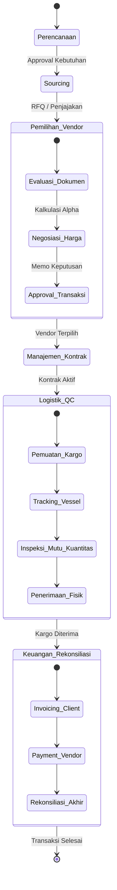
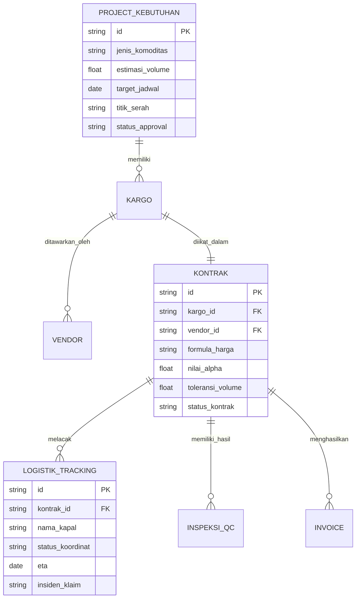

**Act as an Expert System Architect and Full-Stack Business Analyst.**

I am building a large-scale **Commodity Procurement and Trading Dashboard (Aplikasi Manajemen Pengadaan Impor Komoditas)**. I will handle the specific tech stack (React, Node, Go, etc.) myself. Your task is to process these core business requirements, system flows, and modular structures to generate the architectural design, database schemas (JSON/Typescript interfaces), and step-by-step logic implementation plans for the -End components and Back-End APIs.

### 1. PROJECT OVERVIEW

This enterprise application manages the end-to-end supply chain of commodity imports. It covers two business models:

1. **Management Importer:** We act as the manager; a third party acts as the importer.
2. **Direct Importer:** We act directly as the importer and buyer.

The system must handle high-stakes transactions requiring strict Segregation of Duties (SoD), complex pricing formulas (Base Price + Alpha/Differential), logistics tracking, QA/QC inspections, and financial reconciliations.

### 2. SYSTEM WORKFLOW (MERMAID)

Here is the core business process flow. Use this to design the state machines and component routing.

### 3. ENTITY RELATIONSHIP DIAGRAM (MERMAID)

Use this conceptual ERD to build the database schema and API payloads.

### 4. CORE MODULES & FEATURES TO IMPLEMENT

**Module 1: Planning & Strategy (Perencanaan)**

- **Logic:** Dynamic forms for commodity specs, volumes, delivery points, and transaction strategy (Spot vs. Term/Berjangka).
- **UI Need:** Multi-step wizard form with an approval status tracker.

**Module 2: Sourcing & Negotiation (Pemilihan & Harga)**

- **Logic:** Data grid comparing vendor proposals. Must include a hidden "Negotiation Limit" (Batas Negosiasi) that is only visible to specific roles. Calculation logic: `Total Cost = Base Market Price + Differential (Alpha) + Logistics Cost`.
- **UI Need:** Side-by-side comparison tables, custom formula input fields, and an Approval Memo generation component.

**Module 3: Contract Management (Kontrak)**

- **Logic:** Managing the master agreement and individual purchase orders. Must link directly to the agreed Alpha and volume tolerances.
- **UI Need:** Document viewer, digital signature workflow integration, and amendment tracking.

**Module 4: Logistics & QA/QC (Logistik & Pemeriksaan)**

- **Logic:** Tracking shipment timelines. Forms to input independent surveyor results (Certificate of Quality/Quantity). Handle volume discrepancies (shrinkage/losses) with threshold alerts.
- **UI Need:** Timeline/Stepper component for shipment status, and a dense data-entry grid for laboratory QA/QC parameters.

**Module 5: Finance & Reconciliation (Keuangan & Rekonsiliasi)**

- **Logic:** Prevent double billing. Segregate invoice components: Cargo Value vs. Logistics Costs vs. Agency Fees. Handle multi-currency conversions and FX differences.
- **UI Need:** Financial dashboard, dual-entry reconciliation table (Planned vs. Actual vs. Invoiced).

**Module 6: Risk & Incident Management (Risiko & Keadaan Kahar)**

- **Logic:** Ticketing system for Force Majeure, demurrage (delay costs), and cargo contamination.
- **UI Need:** Alert banners, incident reporting form, and claim status Kanban board.

### 5. ROLE-BASED ACCESS CONTROL (RBAC)

The UI components and API endpoints MUST enforce strict Segregation of Duties:

1. **Initiator/Planner:** Can create plans, cannot approve.
2. **Negotiator/Commercial:** Can view market prices, input Alpha, and compare vendors.
3. **Logistics/Ops:** Can update shipment status and QA/QC, cannot see pricing formulas.
4. **Finance:** Can view final prices and create invoices, cannot alter QA/QC data.
5. **Approver (Head):** Can approve/reject across all modules.
6. **Auditor (Viewer):** Read-only access to all modules, no mutations allowed.

### 6. YOUR TASK / OUTPUT REQUIREMENTS

Based on the architecture above, please provide:

1. **System Architecture Plan:** A brief explanation of how you would structure the frontend state management and backend micro-services/controllers for this.
2. **Data Models:** Provide the exact JSON/TypeScript interfaces for the `Kontrak`, `Logistik_Tracking`, and `Invoice` entities to support the complex logic described.
3. **Component Strategy:** List the 5 most complex UI components needed (e.g., the Alpha Comparison Grid) and write the pseudo-code or React structure for how to build the most critical one.
4. **API Contract:** Design the REST/GraphQL endpoints needed to handle the "Negotiation & Approval" phase.
